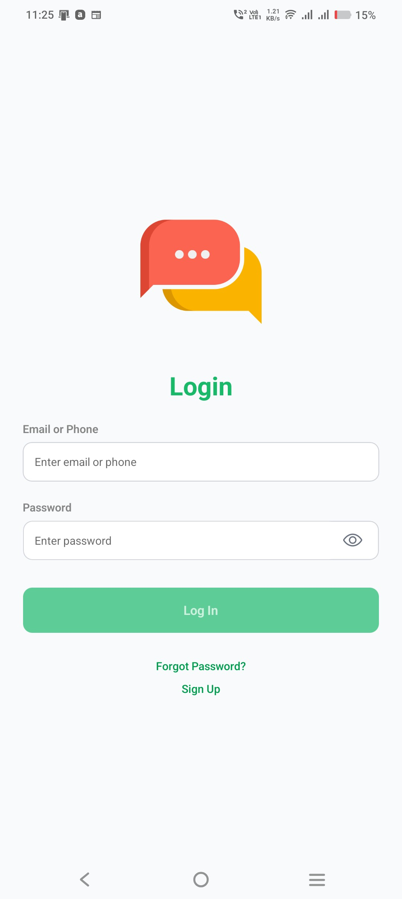
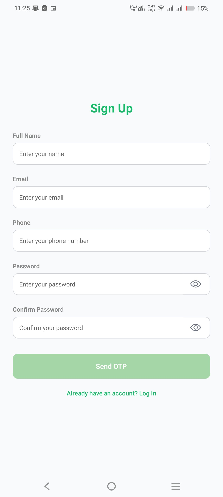
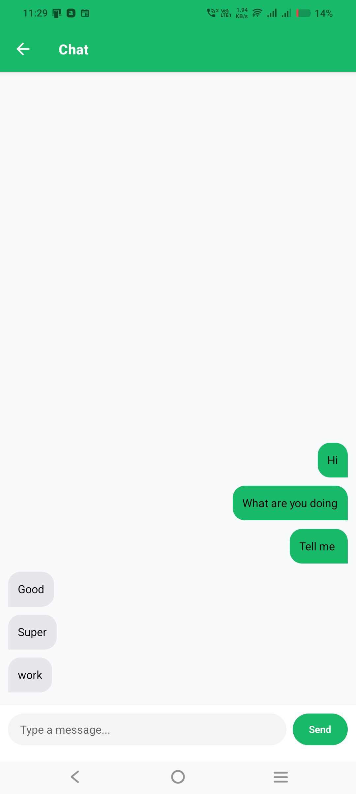
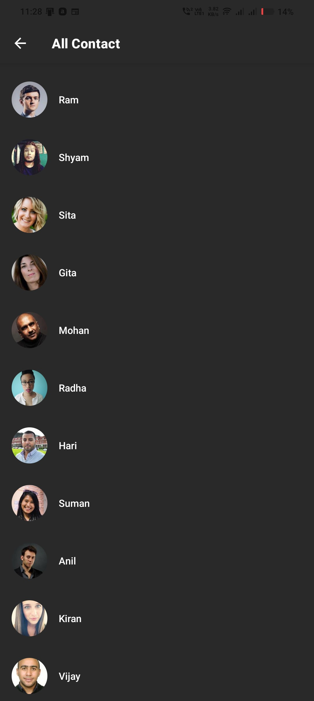
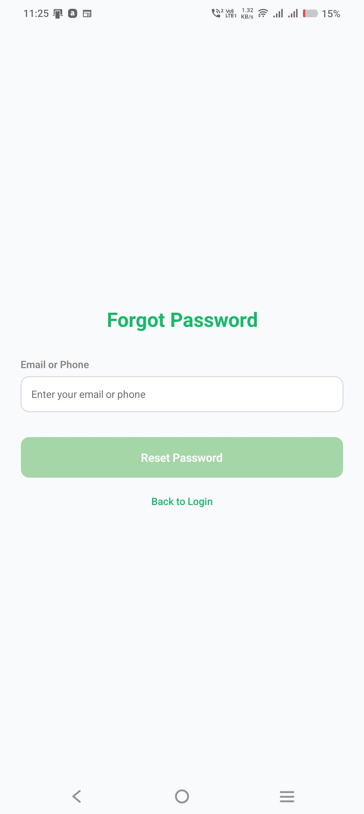
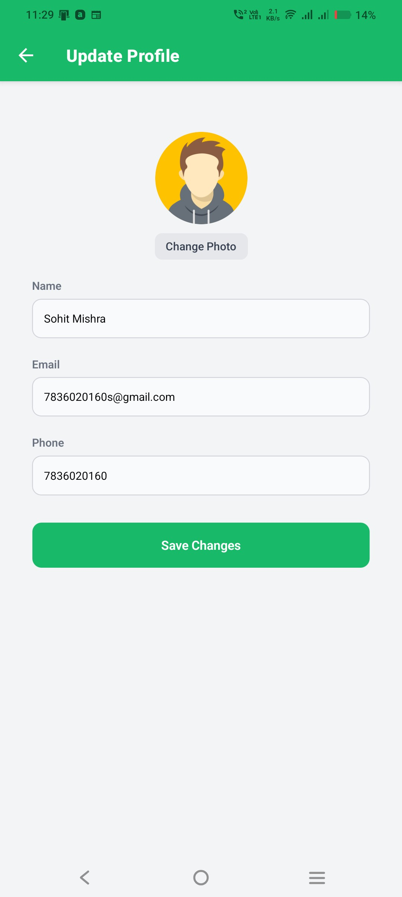
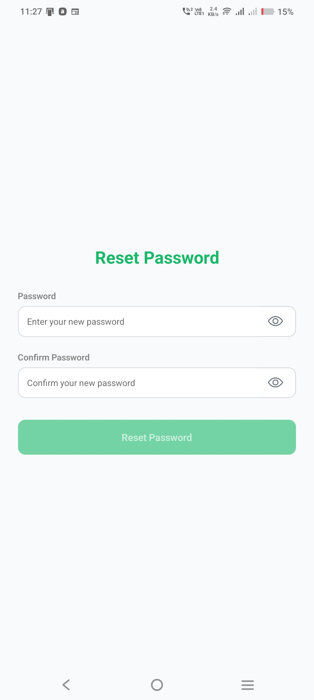

# ChatApp Mobile Screens Overview

This document describes the main screens in the ChatApp mobile application built with **Expo** and **React Native**.

---

## Screens

### 1. **Login Screen**
- **Path:** `login.tsx`
- **Purpose:** Allows users to login using email/phone and password.
- **Features:**
  - Email/phone & password input
  - Forgot password link
  - Navigate to Signup screen
  - AsyncStorage saves token on successful login

---

### 2. **Signup Screen**
- **Path:** `signup.tsx`
- **Purpose:** Register a new user account.
- **Features:**
  - Name, email, phone, password, confirm password fields
  - Navigate to Login screen after successful signup

---

### 3. **Forgot Password Screen**
- **Path:** `forgot-password.tsx`
- **Purpose:** Initiate password reset.
- **Features:**
  - Enter registered email/phone
  - Sends OTP or reset link

---

### 4. **Reset Password Screen**
- **Path:** `reset-password/[token].tsx`
- **Purpose:** Complete password reset after receiving reset link.
- **Features:**
  - New password and confirm password fields
  - Submit button to reset password

---

### 5. **OTP Verification Screen**
- **Path:** `otp.tsx`
- **Purpose:** Verify OTP sent during signup or password reset.
- **Features:**
  - Input OTP code
  - Submit to verify

---

### 6. **Home / Conversation List Screen**
- **Path:** `index.tsx`
- **Purpose:** Display all user conversations.
- **Features:**
  - List of conversations with last message
  - Unread message indicator
  - Navigate to chat screen
  - Floating button to access all contacts

---

### 7. **Chat Screen**
- **Path:** `chat/[recipientId].tsx`
- **Purpose:** Real-time messaging with a selected user.
- **Features:**
  - Send/receive messages in real-time
  - Typing indicators
  - Read receipts
  - Messages are loaded and ordered by timestamp

---

### 8. **Update Profile Screen**
- **Path:** `updateprofile.tsx`
- **Purpose:** Update user profile details and profile picture.
- **Features:**
  - Upload new profile photo
  - Update name and phone number

---

### 9. **Contact / All Users Screen**
- **Path:** `contact.tsx`
- **Purpose:** Show all users to start new conversations.
- **Features:**
  - Navigate to chat screen for selected user

---

### 10. **Page Not Found Screen**
- **Path:** `+not-found.tsx`
- **Purpose:** Displayed when user navigates to an unknown route.
- **Features:**
  - Friendly message and back button

---

## Navigation Overview

- **Stack Navigation:** Managed with `expo-router`  
- **Header Features:**
  - Profile Avatar → Opens profile options (update/logout)
  - Logout button
  - App logo on Home screen

---

## Notes

- All authentication-related screens (login, signup, forgot/reset password, OTP) do not show the header for full-screen experience.
- Chat and profile screens use a custom colored header.
- Offline users are displayed without a green online indicator; online users are updated via Socket.io events.

---

## Run Command

```bash
npx expo start
```

# ChatApp Screenshots

## Login Screen


## Signup Screen


## Chat Screen


## All Contacts Screen


## Conversation Screen


## Forgot Password Screen


## Profile Update Screen


## Reset Password Screen


## Demo Video

👉 [Watch Demo Video](./assets/screenshots/Video.mp4)